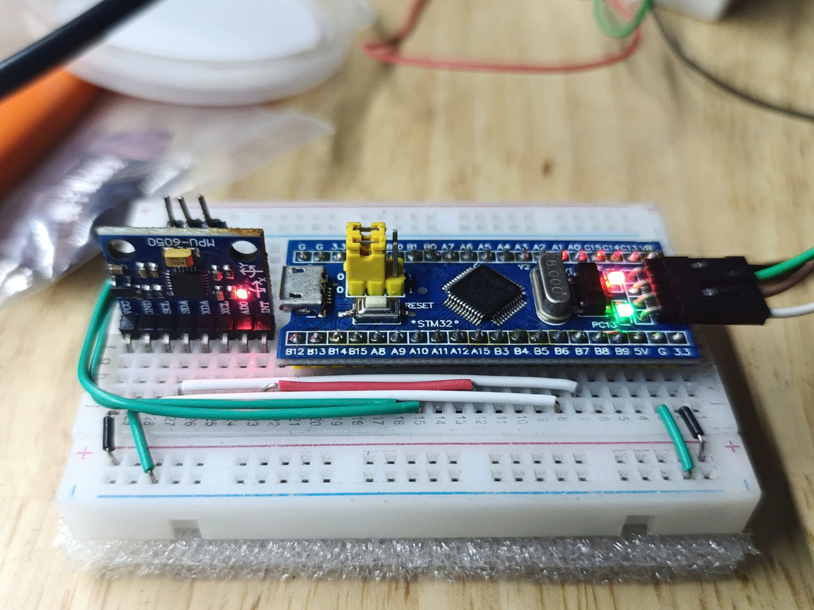

# MPU6050 Project

Welcome to the MPU6050 Project! This project is focused on interfacing the MPU6050 sensor with an embedded system to capture and process motion data.
As I am playing around with this sensor, I will try to make an example for every features available. If the feature you looking for is not listed in 
the example, feel free to contact me and I try to make one as soon as possible.



## Table of Contents

- [Introduction](#introduction)
- [Features](#features)
- [Requirements](#requirements)
- [Installation](#installation)
- [Usage](#usage)
- [Contributing](#contributing)
- [License](#license)

## Introduction

The MPU6050 is a popular 6-axis motion tracking device that combines a 3-axis gyroscope and a 3-axis accelerometer. This project demonstrates how to interface the MPU6050 with an embedded system to read and process motion data.

## Features

- Read accelerometer and gyroscope data
- Calculate orientation and motion
- Example code for quick start with various MCUs
- Testing with Filters

## Requirements

- MPU6050 sensor module
- Microcontroller (e.g., Arduino, STM32, ESP32)
- I2C communication interface
- Development environment (e.g., Arduino IDE, PlatformIO)

## Installation

1. Clone the repository:
    ```sh
    git clone https://github.com/UnholySaki@github.com/mpu6050.git
    ```
2. Navigate to the project directory:
    ```sh
    cd mpu6050
    ```
3. Open the project in your preferred development environment.

## Usage

1. Connect the MPU6050 sensor to your microcontroller using the I2C interface.
2. Load the example code from the `examples` directory.
3. Compile and upload the code to your microcontroller.
4. Open the serial monitor to view the sensor data.
   (I just outputed the data through UART, logic analyzer or Debugger is useful
    to see the data)

## Contributing

We welcome contributions! Please follow these steps to contribute:

1. Fork the repository.
2. Create a new branch (`git checkout -b feature-branch`).
3. Make your changes.
4. Commit your changes (`git commit -m 'Add new feature'`).
5. Push to the branch (`git push origin feature-branch`).
6. Open a pull request.

## License

This project is licensed under the MIT License.
Thank you for using the MPU6050 Project! If you have any questions or need further assistance, please feel free to open an issue or contact me.
